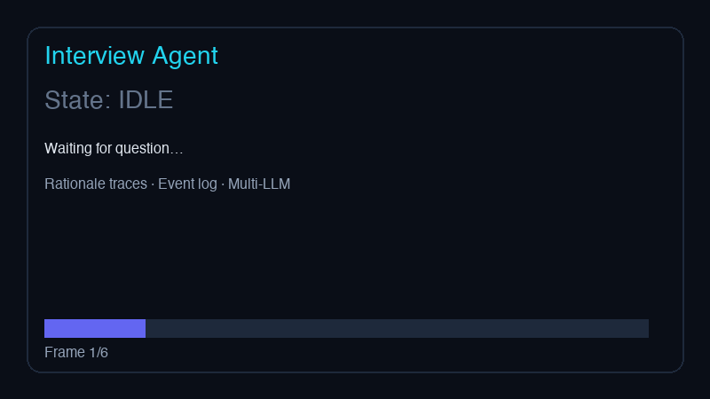

# Interview Agent

<p align="center">
  
</p>

<p align="center">
  <strong>Deterministic AI interview coach</strong> with rationale traces, multi-LLM routing, and auditable agent runs.<br/>
  Built for backend / infra / AI-engineering interview prep — not generic chat.
</p>

<p align="center">
  <a href="QUICKSTART.md">Quickstart</a> ·
  <a href="ARCHITECTURE.md">Architecture</a> ·
  <a href="SAFETY.md">Safety</a> ·
  <a href="CONFIGURATION.md">Configuration</a> ·
  <a href="https://github.com/Francis1998/interview">Knowledge Base</a>
</p>

[](https://github.com/Francis1998/interview-agent/actions/workflows/ci.yml)


---

## Why Interview Agent?

Static interview cheat sheets ([interview](https://github.com/Francis1998/interview)) answer *what* to study. **Interview Agent** answers *how to respond in an interview* — with structured answers, trade-off analysis, and a full audit trail of every decision the agent made.

| Problem | How Interview Agent Solves It |
|---------|-------------------------------|
| **"I read the docs but freeze when asked live"** | Agent returns interview-formatted answers: definition → trade-offs → example → follow-ups |
| **"ChatGPT hallucinates OS/DB details"** | Retrieves from bundled `knowledge/` markdown *before* LLM reasoning — grounded context |
| **"I don't know which LLM to use"** | Decision engine routes to GPT / Claude / Gemini / Kimi based on configured keys |
| **"I can't explain my AI system's decisions"** | Every run emits `DecisionRationale` traces + durable JSONL event log |
| **"Agent frameworks feel like black boxes"** | Explicit state machine: `IDLE → PLANNING → RETRIEVING → REASONING → ANSWERING → DONE` |
| **"I'm worried about runaway API costs"** | Timeouts, tool-call budgets, context truncation, cancellation API |
| **"I need offline CI / demo without API keys"** | Mock LLM adapter returns structured placeholder answers |
| **"Different companies test different stacks"** | 9 topic domains: Python, Go, MySQL, Linux, networking, OS, Redis, algorithms, system design |

---

## Real Use Cases (Starting From Issues)

These map to common pain points raised in interview-prep communities and issue trackers:

### Issue: "Explain GIL but my answer is too shallow"
```bash
interview-agent ask "What is the Python GIL and when does multithreading still help?" --topic python
```
**Agent flow:** classifies `python` → retrieves GIL section from knowledge base → GPT/Claude synthesizes interview answer with I/O-bound vs CPU-bound distinction.

### Issue: "Go GC questions always trip me up"
```bash
interview-agent ask "Walk through Go's three-color concurrent GC" --topic golang --difficulty senior
```
**Rationale trace shows:** topic= golang (keyword score), provider= anthropic, retrieval= keyword_search on `golang.md`.

### Issue: "System design questions have no single correct answer"
```bash
interview-agent ask "Design a rate limiter for a public API" --topic system-design
```
Agent pulls CAP/consistency patterns from knowledge, then LLM structures a scalable design narrative.

### Issue: "I need to compare TCP vs UDP under pressure"
```bash
interview-agent ask "TCP vs UDP for a live video streaming app?" --topic networking
```
KB retrieval surfaces comparison tables; LLM adds application-specific recommendation.

### Issue: "Redis 'single-threaded but fast' sounds contradictory"
```bash
interview-agent ask "Why is Redis fast if it's single-threaded?" --topic redis
```
Deterministic topic classification + epoll/I/O multiplexing context from knowledge base.

### Issue: "My team can't audit what the AI told candidates"
```bash
interview-agent events <run-id>
```
Full JSONL event log: state transitions, decisions, tool calls, LLM metadata.

### Issue: "We use Kimi internally but most tools only support OpenAI"
Set `KIMI_API_KEY` — adapter uses Moonshot's OpenAI-compatible endpoint. Same `AgentRunRequest` API.

### Issue: "I want a demo for my portfolio / team"
```bash
interview-agent serve --port 8080
# http://127.0.0.1:8080 — dark-mode web UI with live traces
```

---

## Features

- **Deterministic decision engine** — topic, provider, model, retrieval strategy with rationale traces
- **State-machine lifecycle** — validated transitions, terminal states, cancellation
- **Durable event log** — append-only JSONL per run
- **Multi-LLM adapters** — OpenAI (GPT), Anthropic (Claude), Google (Gemini), Kimi (Moonshot)
- **Tool abstraction** — pluggable adapters (KB search included)
- **Safety controls** — timeouts, scope allowlist, tool budget, cancellation
- **Production layout** — `src/`, `tests/`, `scripts/`, CI, Alembic migrations scaffold
- **Web demo + CLI** — portfolio-ready UI with live rationale/event panels

---

## Quick Start

```bash
git clone https://github.com/Francis1998/interview-agent.git
cd interview-agent
python -m venv .venv && source .venv/bin/activate
pip install -e ".[dev]"
cp .env.example .env   # add API keys (optional)

# CLI
interview-agent ask "Explain B+ tree indexes in MySQL"

# Web demo
interview-agent serve
```

See [QUICKSTART.md](QUICKSTART.md) for full setup.

---

## Architecture Snapshot

```
Request → DecisionEngine (topic, provider, model)
       → SafetyGuard (scope, timeout)
       → StateMachine (PLANNING → RETRIEVING → REASONING → ANSWERING)
       → InterviewKBTool (knowledge retrieval)
       → LLMAdapter (GPT / Claude / Gemini / Kimi)
       → AgentRunResult (answer + rationale_traces + events)
```

Details: [ARCHITECTURE.md](ARCHITECTURE.md) · Safety: [SAFETY.md](SAFETY.md)

---

## LLM Provider Matrix

| Provider | Environment Variable | Default Model |
|----------|---------------------|---------------|
| OpenAI | `OPENAI_API_KEY` | gpt-4o-mini |
| Anthropic | `ANTHROPIC_API_KEY` | claude-3-5-haiku-latest |
| Google | `GOOGLE_API_KEY` | gemini-1.5-flash |
| Kimi | `KIMI_API_KEY` | moonshot-v1-8k |
| Mock | — | mock-interview-v1 |

---

## Development

```bash
make validate          # lint + typecheck + tests
make demo-gif          # regenerate assets/demo-agent-run.gif
pytest tests/ -v
```

---

## Related Projects

- [interview](https://github.com/Francis1998/interview) — static interview knowledge base (English) that powers this agent's retrieval layer

---

## License

Apache-2.0
